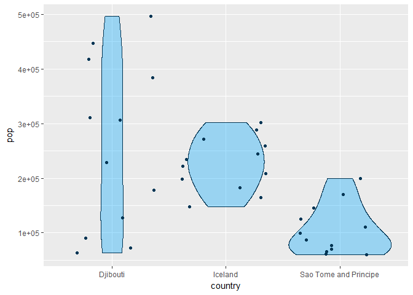

Explore Gapminder and use dplyr
================

1. Smell test the data
======================

We can use the command `str()` to answer the following questions:

``` r
str(gapminder)
```

    ## Classes 'tbl_df', 'tbl' and 'data.frame':    1704 obs. of  6 variables:
    ##  $ country  : Factor w/ 142 levels "Afghanistan",..: 1 1 1 1 1 1 1 1 1 1 ...
    ##  $ continent: Factor w/ 5 levels "Africa","Americas",..: 3 3 3 3 3 3 3 3 3 3 ...
    ##  $ year     : int  1952 1957 1962 1967 1972 1977 1982 1987 1992 1997 ...
    ##  $ lifeExp  : num  28.8 30.3 32 34 36.1 ...
    ##  $ pop      : int  8425333 9240934 10267083 11537966 13079460 14880372 12881816 13867957 16317921 22227415 ...
    ##  $ gdpPercap: num  779 821 853 836 740 ...

-   Is it a data.frame, a matrix, a vector, a list?
    -   Gapminder is a special kind of **data.frame** called tibble
-   What is its class?
    -   Gapminder has the following classes: **tbl\_df**, **tbl** and **data.frame**
-   How many variables/columns?
    -   It has **6 variables**
-   How many rows/observations?
    -   It has **1704 observations**
-   Can you get these facts about “extent” or “size” in more than one way?
    -   **yes**, there are different commands like `class`, `atributtes`, `nrow` and `ncol`. For example:

``` r
class(gapminder)
```

    ## [1] "tbl_df"     "tbl"        "data.frame"

``` r
attributes(gapminder)$names
```

    ## [1] "country"   "continent" "year"      "lifeExp"   "pop"       "gdpPercap"

``` r
attributes(gapminder)$class
```

    ## [1] "tbl_df"     "tbl"        "data.frame"

``` r
nrow(gapminder)
```

    ## [1] 1704

``` r
ncol(gapminder)    
```

    ## [1] 6

-   Can you imagine different functions being useful in different contexts?

-   What data type is each variable?
    -   Type of each variable is expresed on the following table:

| Variable  | Type    |
|-----------|---------|
| country   | Factor  |
| continent | Factor  |
| year      | Integer |
| lifeExp   | Numeric |
| pop       | Integer |
| dgpPercap | Numeric |

2. Explore individual variables
===============================

Pick at least one categorical variable and at least one quantitative variable to explore.

-   What are possible values (or range, whichever is appropriate) of each variable?
-   What values are typical? What’s the spread? What’s the distribution? Etc., tailored to the variable at hand.
-   Feel free to use summary stats, tables, figures. We’re NOT expecting high production value (yet).

### Continent

Let's explore the variable *continent* which is a categorical variable:


The barplot allow us to know this variable has 5 leves: Africa, Americas, Asia, Europe and Oceania. Africa is the category with the maximum number of observations, which is equal to 624; Oceania is the continent with the minimum number of observations, which is equal to 24.

### Country

Regarding the *country* variable, we can visualize the number of observations of each country by the following table:

The data set contains data of **142** different countries from **year 1952 to 2007**, with data of every 5 years.

### Population

``` r
summary(gapminder$pop)
```

    ##      Min.   1st Qu.    Median      Mean   3rd Qu.      Max. 
    ## 6.001e+04 2.794e+06 7.024e+06 2.960e+07 1.959e+07 1.319e+09

During period from 1952 to 2007 the population's range for these countries was \[60011, 1318683096\].

``` r
ggplot(gapminder,aes(x=as.factor(year),y=pop)) +
       geom_boxplot()
```


The side-by-side plot of population by year shows that population tends to increase every year and also we can distinghis the same quantity of outliers across the years, and particularly three outliers. The average and the spread of population by year is summarized in the following table:

| Year | Population's mean | Population's standar deviation |
|------|-------------------|--------------------------------|
| 1952 | 16950402          | 58100863                       |
| 1957 | 18763413          | 65504285                       |
| 1962 | 20421007          | 69788650                       |
| 1967 | 22658298          | 78375481                       |
| 1972 | 25189980          | 88646817                       |
| 1977 | 27676379          | 97481091                       |
| 1982 | 30207302          | 105098650                      |
| 1987 | 33038573          | 114756180                      |
| 1992 | 35990917          | 124502589                      |
| 1997 | 38839468          | 133417391                      |
| 2002 | 41457589          | 140848283                      |
| 2007 | 44021220          | 147621398                      |

Furthermore,during 2007 the top three of countries with biggest and smallest population are:

``` r
data_2007 <- gapminder %>%
             select(country, pop, year) %>% 
             filter(year==2007) 
```

    ## Warning: package 'bindrcpp' was built under R version 3.3.3

``` r
max_2007 <- data_2007 %>% 
            filter(pop >= sort(pop,decreasing=TRUE)[3])

min_2007 <- data_2007 %>% 
            filter(pop <= sort(pop,decreasing=FALSE)[3])
```

``` r
print(min_2007)
```

    ## # A tibble: 3 x 3
    ##   country                  pop  year
    ##   <fct>                  <int> <int>
    ## 1 Djibouti              496374  2007
    ## 2 Iceland               301931  2007
    ## 3 Sao Tome and Principe 199579  2007

``` r
print(max_2007)
```

    ## # A tibble: 3 x 3
    ##   country              pop  year
    ##   <fct>              <int> <int>
    ## 1 China         1318683096  2007
    ## 2 India         1110396331  2007
    ## 3 United States  301139947  2007

We can appreciate that population distributions of the countries with the biggest population are different:

``` r
gapminder %>% 
filter(country=="China" | country=="India" | country=="United States") %>% 
ggplot(aes(country,pop)) +
geom_violin() +
geom_jitter(alpha=0.25)
```


We can appreciate that population distributions of the countries with the smallest population are different:

``` r
gapminder %>% 
filter(country=="Djibouti" | country=="Iceland" | country=="Sao Tome and Principe") %>% 
ggplot(aes(country,pop)) +
geom_violin() +
geom_jitter(alpha=0.25)
```


Life expectancy and gdpPerCapita
================================

In order to observe the relation described by the life expectancy and gdp Per Capita, the next plot can be drawn

``` r
gapminder %>% 
  filter(year==2007) %>% 
  ggplot(aes(gdpPercap,lifeExp,color=continent)) +
       geom_point()
```



We can observe as the gdp Per Capita increases, the life expectancy increases too, not in a linear way, so we can just say that these variables have a **positive** relation. The color of points indicates the most of low gdp Per Capita and low life expectacy countries, correspond to Africa continent.
